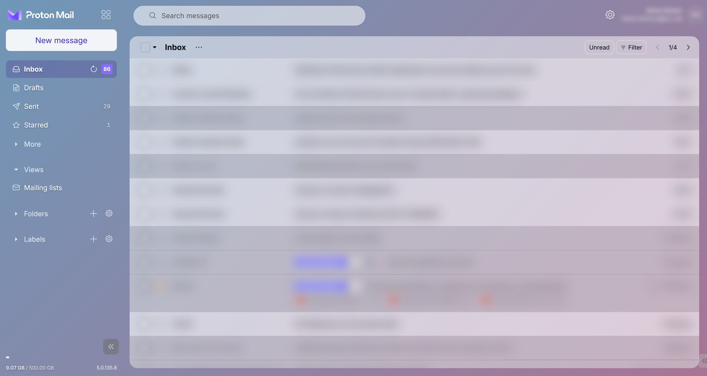
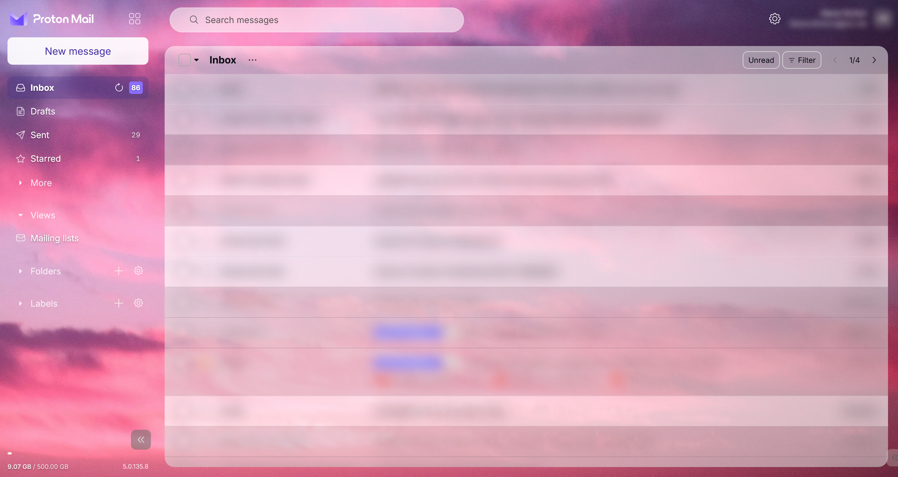
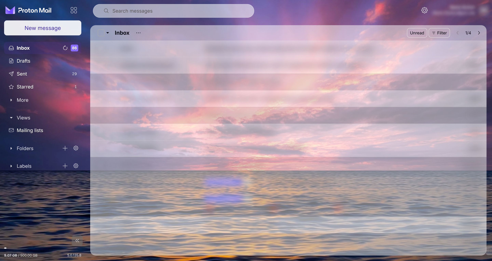

# Proton Mail – Frosted Glass
A Stylus skin for Proton Mail giving a modern frosted glass aesthetic

A custom CSS theme for [Proton Mail](https://mail.proton.me/) that gives the interface a softer, frosted-glass appearance.

Designed for use with the [Stylus](https://add0n.com/stylus.html) browser extension.

The theme features translucent panels, rounded corners, a cleaner inbox layout and a transparent sidebar. It uses a blue-to-purple gradient by default, with an optional add-on that lets you use your own photograph as the background.

## Features

- **Frosted-glass inbox** – A translucent, rounded message panel with background blur.
- **Transparent sidebar** – White navigation text designed to remain legible against darker backgrounds.
- **Rounded search bar** – Translucent when idle, with a solid white background when focused.
- **Refined message rows** – Subtle separators, hover shadows and highlighted selections.
- **Updated compose button** – A white New Message button with purple text.
- **White email reading panel** – Opened messages retain a solid white background for readability.
- **Customisable appearance** – CSS variables at the top of the stylesheet make it easy to adjust colours, opacity and corner radius.
- **Optional background photograph** – Use your own image without modifying the main theme.

## Screenshots

### Default gradient

The built-in blue-to-purple gradient, without any additional background image.

### Custom background – Pink

An example of the theme with a colourful photographic background.

### Custom background – Dark

An example using a darker photograph, providing greater contrast with the white sidebar text.

## Installation

### Requirements

- A browser with the Stylus extension installed.
- A Proton Mail account.

### 1. Install the main theme

1. Install [Stylus](https://add0n.com/stylus.html) if you haven't already.
2. Open [`proton-mail-frosted-glass.user.css`](proton-mail-frosted-glass.user.css) in this repository.
3. Click **Raw**.
4. Stylus should recognise the UserCSS file and offer to install it.
5. Confirm the installation and refresh [Proton Mail](https://mail.proton.me/).

The theme works immediately using its default gradient background.

### 2. Optional: Add your own background photograph

The background-photo add-on allows you to use a personal photograph without changing the main stylesheet.

1. Open [`proton-mail-background.user.css`](proton-mail-background.user.css) in this repository.
2. Click **Raw** and install it through Stylus.
3. Open the installed add-on in the Stylus editor.
4. Follow the instructions at the top of the stylesheet to add your photograph.
5. Save and refresh Proton Mail.

You can use either an embedded image (base64) or an image hosted online.

**Recommended images:**
- Landscape orientation, ideally around 2560 pixels wide.
- JPEG or WebP format.
- Preferably under 400 KB.
- Darker or mid-tone images for better contrast with the white sidebar text.

If you disable the add-on, the main theme returns to its default gradient.

**Important:** If you edit the add-on to include your own image, keep a backup. Future updates may overwrite your changes.

## Customisation

### Proton Mail's built-in themes

The theme you select in Proton Mail's own appearance settings can affect how certain buttons, icons and text appear when using Frosted Glass.

For the best results, try switching between Proton Mail's built-in themes (**Settings → Appearance → Theme**) to see which combination looks and works best for you. Different themes may produce slightly different colours and contrast.

For a cleaner look of the inbox checklist, toggle Proton's sender images off: Settings → All settings → Messages and composing → Other Preferences → turn off “Show sender images”.

The main stylesheet includes a set of CSS variables near the top:

| Variable | Purpose |
|---|---|
| `--g-radius` | Corner radius of the inbox panel |
| `--g-panel` | Inbox background colour and transparency |
| `--g-row-read` | Read-message background |
| `--g-row-unread` | Unread-message background |
| `--g-row-divider` | Separator colour between messages |
| `--g-accent` | Compose-button text colour |

You can modify these values in the Stylus editor to adjust the appearance.

## Compatibility

- **Website:** Proton Mail (`mail.proton.me`)
- **Extension:** Stylus
- **Browser:** Developed for Firefox; compatibility with other browsers has not been fully tested.

This theme modifies Proton Mail's interface using CSS selectors. Changes to Proton Mail's website may occasionally affect its appearance or functionality.

## Updates

Updates to the theme will be published in this repository.

If you have installed the UserCSS file directly from GitHub, Stylus can check for updates to the hosted stylesheet.

If you have customised the CSS locally, back up your changes before updating.

## Disclaimer

This is an unofficial, community-created theme. It is not affiliated with, endorsed by or maintained by Proton AG.

The stylesheet changes the appearance of Proton Mail only. It does not access, collect or transmit email content or account information.

## Licence

Released under the [MIT License](LICENSE).

You are free to use, modify and redistribute the stylesheet under the terms of that licence.
